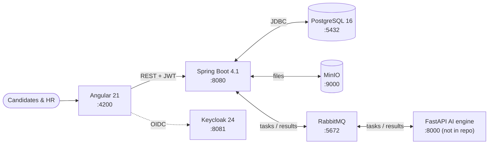
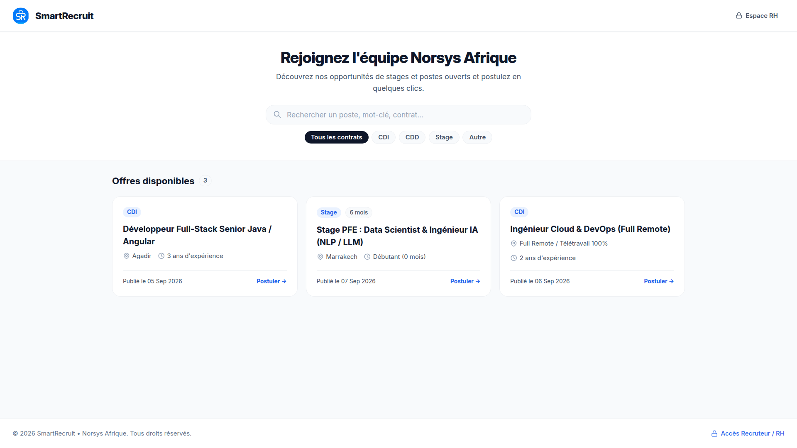
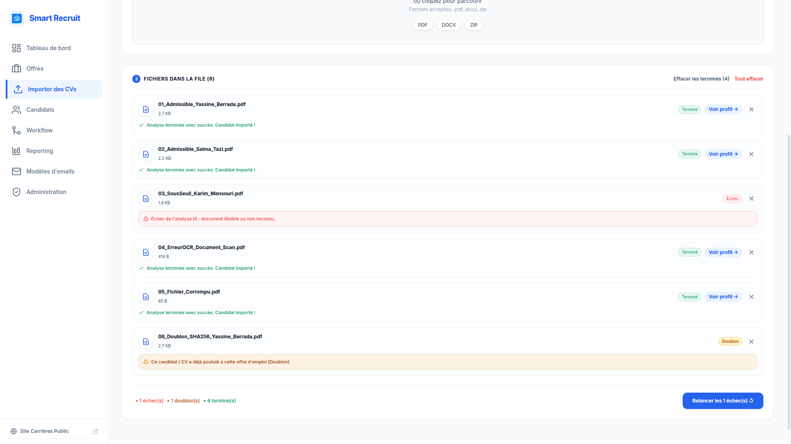
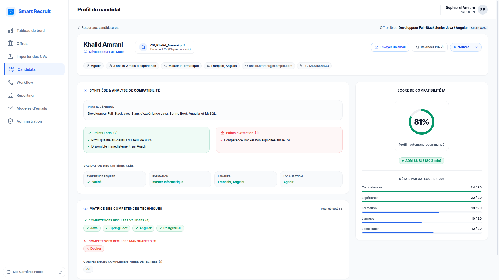
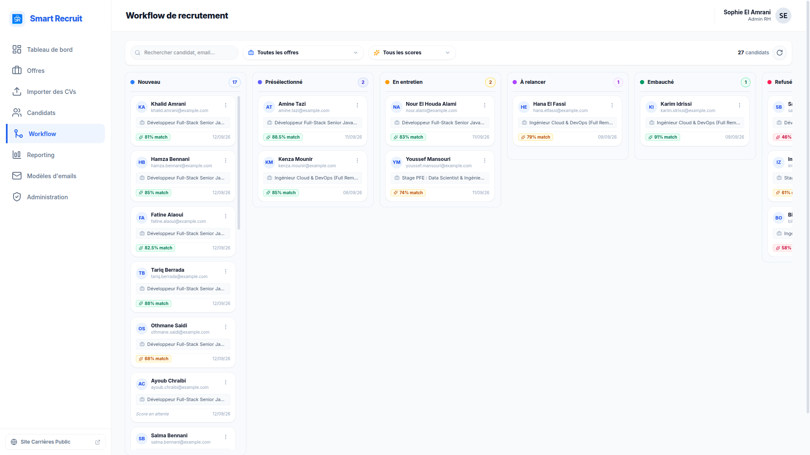

# SmartRecruit


An intelligent HR recruitment platform that automates CV processing, weighted AI scoring, candidate pipeline management, and campaign reporting.

Built for **Norsys Afrique** — Angular 21 frontend · Spring Boot 4.1 backend · external AI engine (contracted, simulated locally).

## Overview



The AI engine is external; local runs use in-JVM simulators over the same RabbitMQ flow (`AI_SIMULATION_ENABLED=true`). See the full [component map](docs/03-architecture/README.md).

**Stack:** Angular 21 · Spring Boot 4.1 / Java 21 · PostgreSQL 16 · Keycloak 24 · RabbitMQ · MinIO — full detail in the [backend](docs/03-architecture/backend.md) and [frontend](docs/03-architecture/frontend.md) architecture.

## Quick Start

```bash
# 1. Start infrastructure
docker compose up -d

# 2. Backend  → http://localhost:8080
cd backend && ./mvnw spring-boot:run

# 3. Frontend → http://localhost:4200
cd frontend && pnpm install && pnpm start
```

Default login: **`admin` / `admin`** (`HR_ADMIN`). Full setup, ports, and credentials: [Getting Started](docs/02-getting-started.md).

## Screenshots

<table>
  <tr>
    <td width="50%"></td>
    <td width="50%"></td>
  </tr>
  <tr>
    <td width="50%"></td>
    <td width="50%"></td>
  </tr>
  <tr>
    <td width="50%"></td>
    <td width="50%"></td>
  </tr>
  <tr>
    <td width="50%"></td>
    <td width="50%"><a href="docs/assets/07-cv-pipeline-async.mp4"></a></td>
  </tr>
</table>

*Click the last thumbnail to play the async CV pipeline demo (MP4, 52 s). Full list: [asset index](docs/assets/README.md).*

## Documentation

Start at the [documentation home](docs/README.md). Common entry points:

| Topic | Guide |
|-------|-------|
| Project context, roles, scope | [Overview](docs/01-overview.md) |
| Run the full stack | [Getting Started](docs/02-getting-started.md) |
| System design | [Architecture](docs/03-architecture/README.md) |
| Features | [CV Ingestion](docs/04-features/cv-ingestion.md) · [Reporting](docs/04-features/reporting.md) |
| REST API | [API Reference](docs/06-api/reference.md) |
| Contributing | [Git workflow](CONTRIBUTING.md) |
