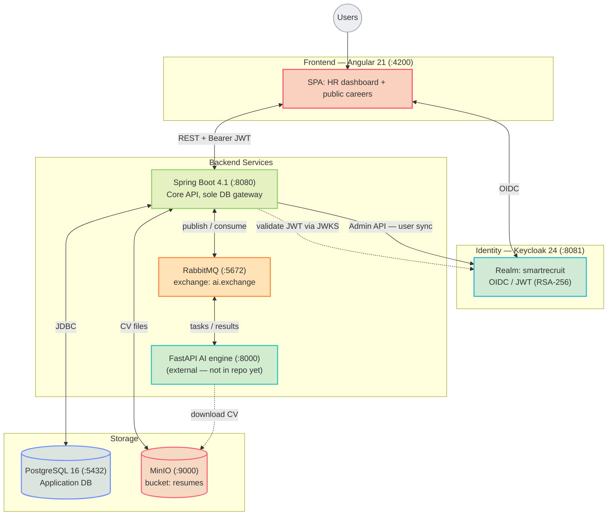

# Architecture

High-level component map, service directory, and the non-negotiable design rules of the platform.

## Component map

The FastAPI AI engine is contracted but not part of this repository; the two AI pipelines below run over RabbitMQ, with in-JVM simulators standing in locally (see [CV Ingestion](../04-features/cv-ingestion.md) and [AI Contract](../05-integrations/ai-contract.md)). The backend also owns identity synchronization: it mirrors Keycloak users into the PostgreSQL `app_user` table via the Admin API and JIT provisioning, so domain foreign keys always resolve.

## Service directory

| Service | Host | Technology | Responsibility |
|---------|------|------------|----------------|
| Frontend | `:4200` | Angular 21, Tailwind v4 | HR dashboard and public careers portal |
| Backend | `:8080` | Spring Boot 4.1, Java 21 | REST API, business logic, sole DB gateway, async orchestration |
| Message broker | `:5672` | RabbitMQ | Durable async task/result queues |
| AI engine | `:8000` | FastAPI (external) | NLP extraction and weighted scoring; not in this repo yet |
| Identity | `:8081` | Keycloak 24 | OIDC login, JWT signing, RBAC |
| Database | `:5432` | PostgreSQL 16 | Relational store (accessed only by the backend) |
| File storage | `:9000` | MinIO | S3-compatible storage for CV documents |
| Email | `:8025` | Mailpit | Local SMTP catch-all |
| DB UI | `:8082` | Adminer | Local database inspector |

## Architecture invariants

These rules are enforced across the codebase:

1. **Spring Boot is the sole DB gateway** — the FastAPI engine has no direct database access. All persistence flows through the backend.
2. **RabbitMQ is the primary async channel** — AI results are consumed via `@RabbitListener` (durable). The HTTP callback endpoints exist as a secondary/fallback path.
3. **No scoring in Spring Boot** — `totalScore`, `categoryScores`, and `extractedMatching` are set exclusively by the AI result. The backend never computes scores.
4. **Offer publish gate** — an offer can transition to `ACTIVE` only when `offerAiStatus == SUCCESS`.
5. **Null-only candidate enrichment** — the AI result populates `firstName`, `lastName`, `email`, and `phone` only when they are null or blank. Confirmed data is never overwritten.
6. **SHA-256 deduplication** — identical CV binaries are stored once. Scoring is recomputed per application against each offer's criteria.
7. **Stateless backend** — no server-side session; every request is authenticated via Keycloak JWT.
8. **Backend owns identity synchronization** — `app_user` rows are provisioned just-in-time from JWT claims and updated through the Keycloak Admin API (dual-write with compensating rollback).

## Two AI pipelines

| Pipeline | Trigger | Request queue | Result channel |
|----------|---------|---------------|----------------|
| CV ingestion & scoring | CV upload / import | `cv.processing.queue` | `cv.sync.queue` → `CvSyncConsumer` |
| Offer pre-processing | Offer create / update | `offer.processing.queue` | `POST /api/v1/internal/offers/sync` |

See [Messaging](../05-integrations/messaging.md) for the full topology.

> [!TIP]
> The rationale behind these choices is collected in [Design Decisions](../08-appendices/decisions.md).

## Related

- [Backend](backend.md)
- [Frontend](frontend.md)
- [Database](database.md)
- [Security](security.md)
