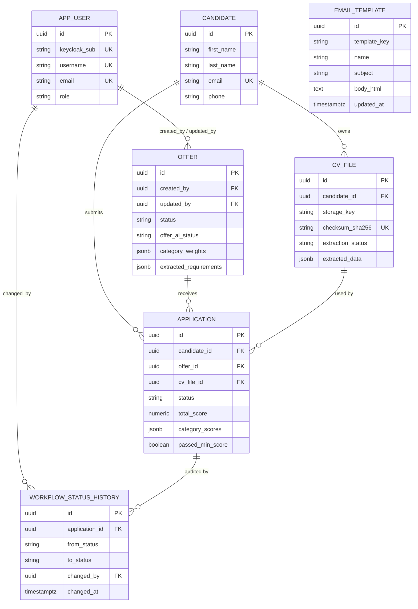

# Database architecture

## Purpose

PostgreSQL 16 is the application's single relational store, accessed exclusively by Spring Boot. The schema is managed by Flyway and designed around three concerns: candidate/CV separation, asynchronous AI data, and auditability.

## Tables

| Table | Purpose |
|-------|---------|
| `app_user` | Local mirror of Keycloak users (`keycloak_sub` is the join key). FK target for domain entities. |
| `offer` | Job postings with JSONB scoring weights/criteria and AI extraction results. |
| `candidate` | Candidate identity. Separated from CV files (1:N) to support future candidate accounts. |
| `cv_file` | Uploaded document metadata, SHA-256 checksum, and extracted AI data. |
| `application` | Candidate × offer link holding workflow status and AI score. |
| `workflow_status_history` | Append-only audit log of status transitions. |
| `email_template` | Configurable, placeholder-driven recruitment messages. |

`app_user` holds no credentials. Identity is owned by Keycloak; see [Security](security.md).

## Entity relationships

## Key design decisions

### Candidate / CV separation

`candidate` and `cv_file` are 1:N. This supports a future model where an authenticated candidate manages multiple CVs and chooses which to submit, without a schema change.

### Implicit (stateless) candidates

`candidate.email` is `UNIQUE` but nullable. Re-applications by the same email reuse the existing candidate; bulk-imported "ghost" CVs (null email) coexist because PostgreSQL permits multiple `NULL`s in a unique column.

### One application per candidate/offer

`application` has `UNIQUE (candidate_id, offer_id)`. Re-applying updates the existing row (for example, replacing `cv_file_id`) rather than creating a duplicate.

### Honest timestamps

A database trigger (`trg_offer_updated_at`) sets `updated_at = CURRENT_TIMESTAMP` before every `UPDATE` on `offer` (and `email_template`), so timestamps stay correct even for raw SQL updates outside Hibernate.

### Score stored with the application

`total_score`, `category_scores`, and `extracted_matching` live on `application` as a 1:1 record rather than in a separate table, avoiding a join on every ranking load.

## Foreign key cascade rules

**`ON DELETE CASCADE` (cleanup):**
- `cv_file.candidate_id`, `application.candidate_id` — deleting a candidate removes their CVs and applications.
- `application.offer_id` — deleting an offer removes its applications.
- `application.cv_file_id` — deleting a CV removes the attached application (avoids triangle-dependency failures).
- `workflow_status_history.application_id` — audit rows follow their application.

**`ON DELETE SET NULL` (audit preservation):**
- `offer.created_by`, `offer.updated_by`, `workflow_status_history.changed_by` — deleting an HR user preserves business records and audit logs; the reference becomes `NULL`.

## Nullability strategy

The schema deliberately mixes strict constraints with nullability for AI-pending and audit fields.

Full nullability matrix

| Category | Rule |
|----------|------|
| **Strict** | `app_user` identity fields, `offer` core fields, `cv_file` metadata, `application` keys/status, `workflow_status_history` keys — all `NOT NULL`. |
| **Flexible business fields** | `offer.contract_type`, `min_score`, `description_markdown`, `category_criteria`, `duration_months` — nullable; enforced at the DTO/frontend layer to avoid hardcoding policy in SQL. |
| **AI-pending** | `candidate` name/email/phone, `cv_file.extracted_data`/`processed_at`, `application.total_score`/`category_scores`/`extracted_matching`/`scored_at`, `offer.extracted_requirements` — `NULL` until the AI completes. |
| **Audit** | `workflow_status_history.from_status` is null for the initial transition; `changed_by`/`created_by`/`updated_by` are null after user deletion. |

## Indexes

| Index | Query it serves |
|-------|-----------------|
| `idx_offer_created_by` | "My offers" (`WHERE created_by = ?`) |
| `idx_offer_status` | Active vs closed offer lists |
| `idx_candidate_email` | Candidate lookup by email on re-apply |
| `idx_cv_file_candidate` | A candidate's CVs |
| `idx_application_offer`, `idx_application_candidate`, `idx_application_status` | Common filters |
| `idx_application_offer_score` | Top candidates per offer: `WHERE offer_id = X ORDER BY total_score DESC` — pre-sorted, no in-memory sort |
| `idx_workflow_history_application` | Audit trail per application |
| `idx_application_ai_passed` (partial, `status = 'NEW'`) | Dashboard AI-performance KPI |
| `idx_offer_ai_pending` (partial, `offer_ai_status = 'PENDING'`) | Offers awaiting AI pre-processing |

## Migrations

Schema changes are Flyway-only; Hibernate runs with `ddl-auto: validate`. See [Migrations](../07-operations/migrations.md) for the version history and the checksum-mismatch recovery procedure.

## Related

- [Backend](backend.md)
- [Security](security.md)
- [Migrations](../07-operations/migrations.md)
- [Design Decisions](../08-appendices/decisions.md)
