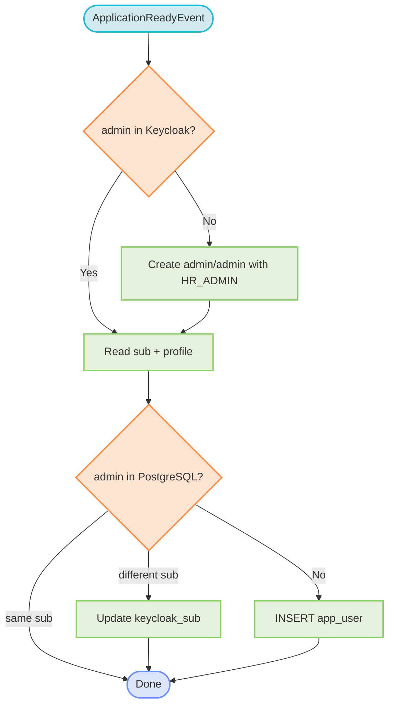
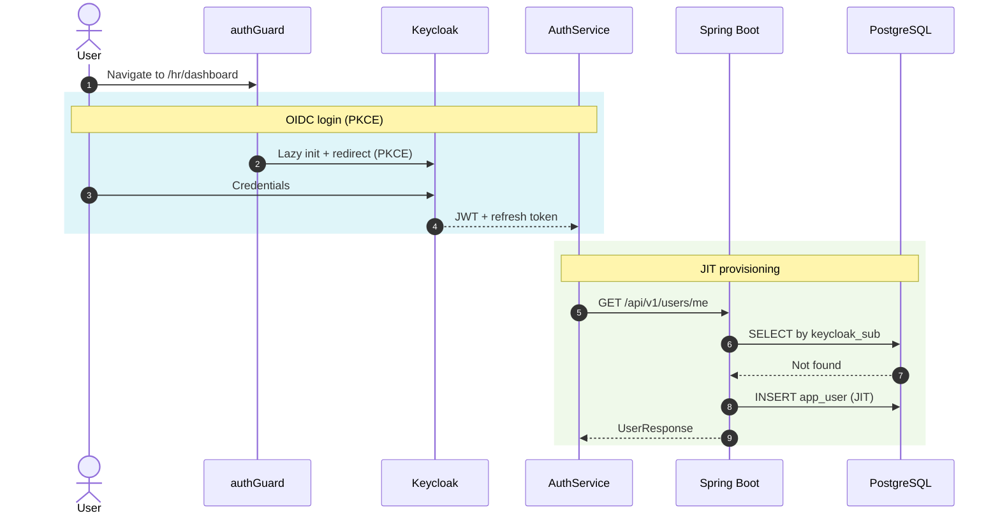

# Security & identity

## Purpose

SmartRecruit uses a hybrid identity model: **Keycloak** owns credentials, sessions, and token issuance; **PostgreSQL** stores minimal user metadata needed for domain foreign keys (who created an offer, who changed a status).

## Core principles

| # | Principle | Rationale |
|---|-----------|-----------|
| 1 | Zero password footprint | Passwords, MFA, and sessions live only in Keycloak; no credentials in the application DB. |
| 2 | Stateless JWT verification | The backend is an OAuth2 Resource Server validating signatures against Keycloak's JWKS. |
| 3 | Local relational identity | `app_user.keycloak_sub` (UUID) links Keycloak to domain FKs. |
| 4 | JIT provisioning | First login auto-creates the `app_user` row from JWT claims. |
| 5 | DB-first RBAC | Roles are resolved from PostgreSQL each request, so changes apply immediately. |
| 6 | Non-blocking public traffic | `/careers/**` never initializes Keycloak. |

## Keycloak configuration

Realm `smartrecruit`, its clients, roles, and the backend service account are documented in [Keycloak Integration](../05-integrations/keycloak.md). The backend validates JWTs against the realm's JWKS and operates strictly inside the `smartrecruit` realm — it never uses the `master` realm.

## Startup — admin seeder

`AdminSeeder` runs on `ApplicationReadyEvent` and self-heals the default account:

The `admin` account is also pre-seeded in `realm-export.json`; the seeder enforces role mappings on every startup.

## Frontend authentication

- **Deferred lazy init** — Keycloak is *not* initialized in `APP_INITIALIZER` (which causes `check-sso` iframe freezes on public pages). `KeycloakInitService` initializes only when `authGuard` first intercepts a protected route.
- **Reactive state** — `AuthService` exposes `isAuthenticated`, `roles`, `currentUser` signals plus derived `isAdmin`, `isRecruiter`, `isViewer` computeds. State syncs on token refresh.
- **Bearer interceptor** — `keycloakBearerInterceptor` skips `/api/v1/public/**` and attaches `Authorization: Bearer <JWT>` elsewhere, refreshing if the token expires within 30 s.

## Backend authentication

`SecurityConfig` configures a stateless OAuth2 Resource Server:

- Session policy `STATELESS`; CSRF disabled; CORS from `app.cors.allowed-origins`.
- `permitAll()`: `/v3/api-docs/**`, `/swagger-ui/**`, `/api/v1/public/**`, `/api/v1/internal/**`.
- Everything else requires a valid Bearer JWT.

`JwtAuthConverter` resolves authorities **DB-first**: if the user exists in `app_user`, the role is read from PostgreSQL (`ROLE_<role>`); otherwise it falls back to the JWT `realm_access.roles` claim. This makes role changes effective on the next request.

`SecurityUtils` exposes `getCurrentUserSub()` and `getCurrentUser()` (with JIT provisioning fallback) to any component.

## JIT provisioning

On the first protected call for a new user:

1. No `app_user` matching `keycloak_sub`? Search by username, then email.
2. If found — link by updating `keycloak_sub` and syncing profile fields.
3. If not found — insert a new `app_user` from JWT claims; role from `realm_access.roles`.

`GET /api/v1/users/me` is strictly read-only; synchronization happens via JIT provisioning or explicit updates.

## User lifecycle

**Create (`HR_ADMIN`):** validate uniqueness, generate a random password (`app.security.password.length`, default 12), create the Keycloak user with a temporary password, assign the realm role and account client roles, insert `app_user`, send a welcome email. Failures trigger compensating deletion in Keycloak.

**Update (`PUT /api/v1/users/me`):** dual-write — Keycloak first, then PostgreSQL. If PostgreSQL fails, a compensating rollback restores the previous Keycloak state.

**Delete (`HR_ADMIN`):** self-deletion returns `400`; Keycloak deletion is idempotent (a 404 is ignored so legacy records still clean up in PostgreSQL).

## RBAC matrix

Full endpoint-to-role matrix

| Endpoint pattern | Method | Roles |
|------------------|--------|-------|
| `/api/v1/public/**` | GET, POST | Anonymous |
| `/api/v1/internal/**` | POST | Open (internal network) |
| `/api/v1/users/me` | GET, PUT | Any authenticated |
| `/api/v1/users/**` | All | `HR_ADMIN` |
| `/api/v1/offers` (read) | GET | `HR_ADMIN`, `RECRUITER`, `VIEWER` |
| `/api/v1/offers/**` (write) | POST, PUT, PATCH | `HR_ADMIN`, `RECRUITER` |
| `/api/v1/applications` (read) | GET | `HR_ADMIN`, `RECRUITER`, `VIEWER` |
| `/api/v1/applications/**` (write) | PUT, POST, DELETE | `HR_ADMIN`, `RECRUITER` |
| `/api/v1/workflow/**` | All | `HR_ADMIN`, `RECRUITER` |
| `/api/v1/dashboard/**` | GET | `HR_ADMIN`, `RECRUITER`, `VIEWER` |
| `/api/v1/reporting/**` | GET | `HR_ADMIN`, `RECRUITER`, `VIEWER` |

## First login sequence

## Related

- [Backend](backend.md)
- [Keycloak Integration](../05-integrations/keycloak.md)
- [API Errors](../06-api/errors.md)
