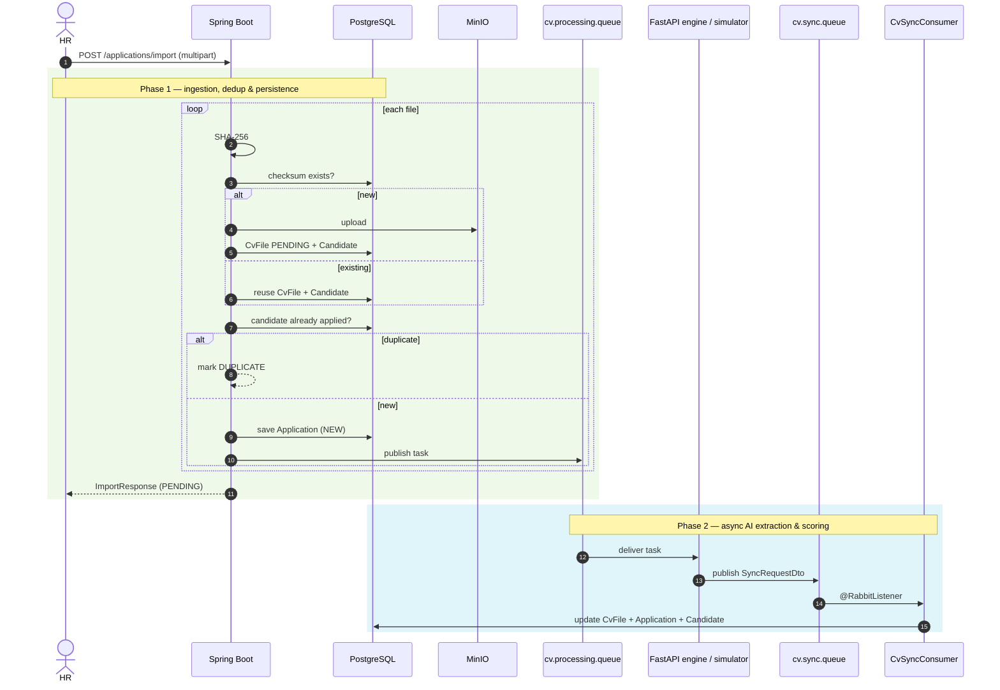

# CV ingestion & scoring

## Purpose

The entry point for candidate profiles. Two channels feed the platform:

1. **Public application** (`/careers/:id`) — a candidate submits a form plus a CV.
2. **HR bulk import** — a recruiter uploads PDF/DOCX files or ZIP archives against an offer.

Both produce a `Candidate`, a `CvFile`, and an `Application`, then dispatch an asynchronous AI scoring task.

## Screenshots

*Click the poster to play the async CV extraction pipeline demo (MP4, 52 s).*

## How it works

### Public application — `POST /api/v1/public/applications/apply`

1. Candidate submits `ApplyRequest` (firstName, lastName, email, phone, offerId, file).
2. Backend looks up the candidate by email: reuse and update, or create a new ghost candidate.
3. Compute the SHA-256 checksum; upload to MinIO if new; create `CvFile` (`PENDING`) and `Application` (`NEW`).
4. Publish a task to `cv.processing.queue`.

### HR bulk import — `POST /api/v1/applications/import`

1. Recruiter drops files/ZIP against an offer.
2. For each entry: compute SHA-256, dedup against existing `cv_file`, upload if new.
3. Check `UNIQUE (candidate_id, offer_id)`. An existing application is reported as `DUPLICATE`; otherwise a new `Application` is saved and a task queued.
4. Return an `ImportResponse` with per-file statuses.

### Result handling

`CvSyncConsumer` (or the fallback `POST /api/v1/internal/cv/sync`) calls `NlpService.syncCvData()`, which in one transaction:

- stores `extracted_data` and sets `processed_at` on the `CvFile`;
- writes `total_score`, `category_scores`, `extracted_matching`, `scored_at`, and `passed_min_score` on the `Application`;
- enriches the `Candidate` **only for null/blank** name, email, or phone fields.

> [!NOTE]
> `cv.sync.queue` is the primary result path; the HTTP endpoint is a fallback for manual testing and compatibility. Both call the same `NlpService.syncCvData()`.

### UI polling

The frontend watches `GET /api/v1/applications/{id}/extraction-status` with a non-overlapping RxJS `expand` + `timer` stream: exponential backoff from 3 s (×1.5, capped at 15 s). A backend Quartz job (`ExtractionStallDetector`) sweeps every minute and flags files pending beyond the threshold as `STALLED`.

## Task states (UI)

| State | Label | Retryable | Notes |
|-------|-------|:---------:|-------|
| `PENDING` | En attente | Yes | Waiting for the recruiter to start the import |
| `UPLOADING` | Téléchargement | No | Multipart transfer in progress |
| `PARSING` | Extraction IA | No | Polling the backend until terminal |
| `STALLED` | Bloqué | Yes | Pending beyond the stall threshold; "Relancer" |
| `SUCCESS` | Terminé | No | Extraction and scoring complete |
| `DUPLICATE` | Doublon | No | Already applied to this offer |
| `FAILED` | Échec | Yes | Corrupt/unreadable file or AI failure |

## Reference

All ingestion and CV endpoints, with roles, are listed in the [API Reference](../06-api/reference.md#applications--cv-ingestion). Relevant configuration keys (`AI_SIMULATION_ENABLED`, `CV_STALL_THRESHOLD_MINUTES`) are documented in [Configuration](../07-operations/configuration.md).

`re-extract` resets the application scores to null, sets extraction back to `PENDING`, and re-publishes to the queue.

## Related

- [AI Contract](../05-integrations/ai-contract.md)
- [Messaging](../05-integrations/messaging.md)
- [Storage](../05-integrations/storage.md)
- [API Reference](../06-api/reference.md)
