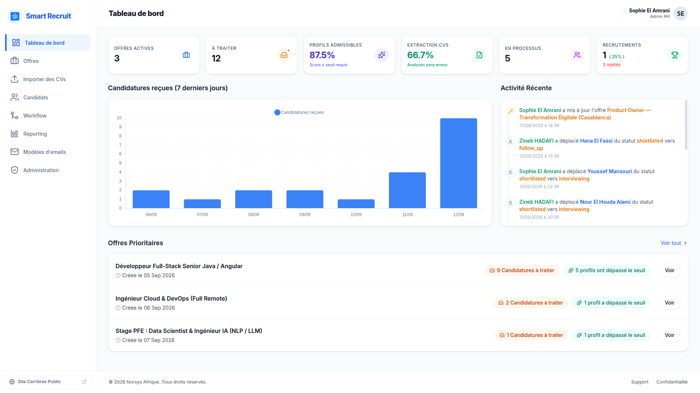

# Dashboard

## Purpose

The landing page for recruiters: at-a-glance pipeline health, AI performance, recent activity, and the offers needing attention most.

## Screenshot

## How it works

### KPI cards

| KPI | Definition |
|-----|------------|
| Active Offers | Count of offers with status `ACTIVE` |
| New Applications | Applications in `NEW` state across all offers |
| CV Extraction Rate | `newExtractedCvs / newApplications × 100` — AI successfully parsed the CV |
| AI Validation Rate | `newPassedAi / newExtractedCvs × 100` — parsed score exceeded the offer's `min_score` |
| Applications in Process | Applications actively moving (e.g. `SHORTLISTED`, `INTERVIEWING`, `FOLLOW_UP`) |
| Hiring Funnel | `HIRED / (HIRED + REJECTED) × 100`, plus raw hired/rejected counts |

Rates guard against division by zero and only evaluate candidates with an extracted score.

### Applications chart
Bar chart of application volume over the **last 7 days**.

### Recent activity
Chronological feed of the **10 most recent** events: offer creation, offer update, and application status change, each with user, target, and timestamp.

### Priority offers
Top 5 offers sorted by the number of `NEW` applications, showing how many already passed the AI threshold.

## Implementation notes

- **Backend** — native SQL queries with `UNION ALL` merge offer updates and workflow history into a single activity feed. Complex aggregates use `COUNT(*) FILTER (WHERE ...)`. Only DTOs are returned; no presentation logic on the server.
- **Frontend** — a 5-minute lazy TTL cache (`shareReplay(1)` + timestamp) avoids refetching on every navigation.
- **Data dependencies** — `application.passed_min_score` must be set by the AI path, and `offer.updated_by` must be set on create/update, or the KPIs and activity feed show incorrect values.

## Reference

Dashboard endpoints, with roles, are listed in the [API Reference](../06-api/reference.md#dashboard).

## Related

- [Reporting](reporting.md)
- [Workflow](workflow.md)
- [API Reference](../06-api/reference.md)
