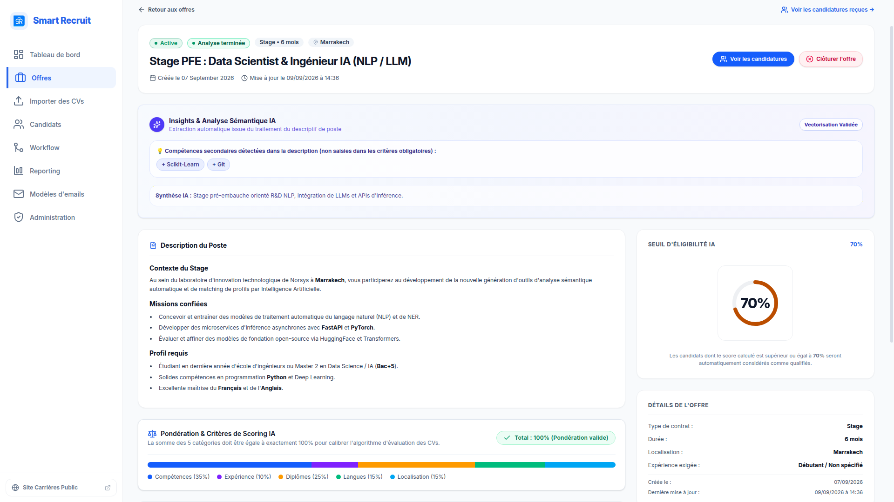
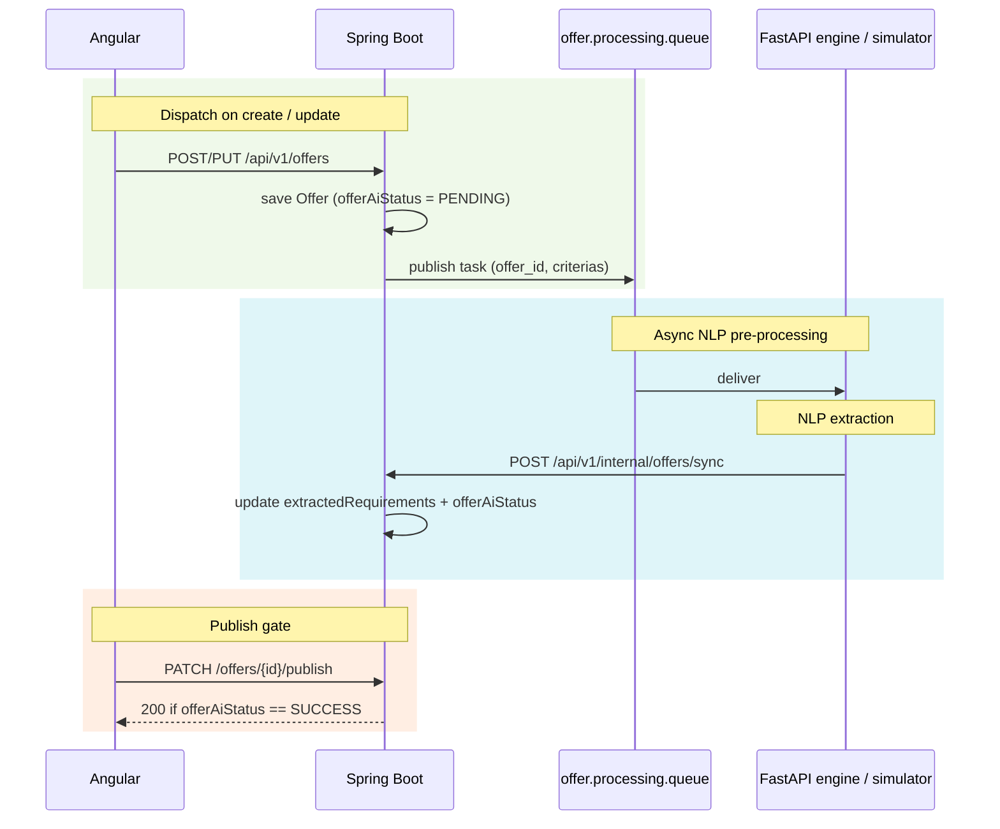

# Offer AI pre-processing

## Purpose

When an offer is created or updated, the backend asynchronously extracts hidden requirements from its markdown description and criteria. This runs independently from the CV scoring pipeline and gates publication.

## Screenshot

## How it works

## `offerAiStatus` state machine

`offer` carries an `offerAiStatus` (`PENDING`, `SUCCESS`, `FAILED`, `STALLED`). The full lifecycle, including stall thresholds and status meanings, is defined in the [AI Contract](../05-integrations/ai-contract.md#offer-status-lifecycle).

## Publish gate

An offer can transition to `ACTIVE` only when `offerAiStatus == SUCCESS`. Publishing while `PENDING`, `FAILED`, or `STALLED` throws `IllegalStateException` and is blocked. This guarantees candidates are scored against an initialized model.

> [!IMPORTANT]
> The gate is enforced server-side: `PATCH /offers/{id}/publish` fails unless `offerAiStatus == SUCCESS`.

On failure or stall, an admin/recruiter can re-dispatch analysis via `POST /api/v1/offers/{id}/reprocess`.

## Payloads

Request and callback schemas are defined in the [AI Contract](../05-integrations/ai-contract.md#offer-pre-processing).

## Simulation mode

When `AI_SIMULATION_ENABLED=true`, `SimulationOfferService` consumes `offer.processing.queue` and posts the callback after a short delay. See [Messaging](../05-integrations/messaging.md#simulation-mode) for the shared simulation behavior and the [AI Contract](../05-integrations/ai-contract.md) for statuses.

## Reference

Offer endpoints, with roles, are listed in the [API Reference](../06-api/reference.md#offers). Relevant configuration keys are documented in [Configuration](../07-operations/configuration.md).

## Related

- [AI Contract](../05-integrations/ai-contract.md)
- [Messaging](../05-integrations/messaging.md)
- [Architecture Invariants](../03-architecture/README.md)
