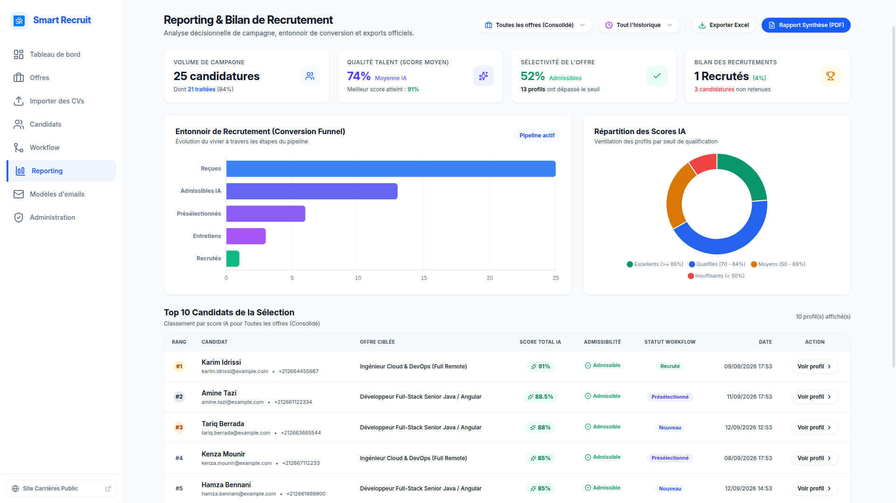
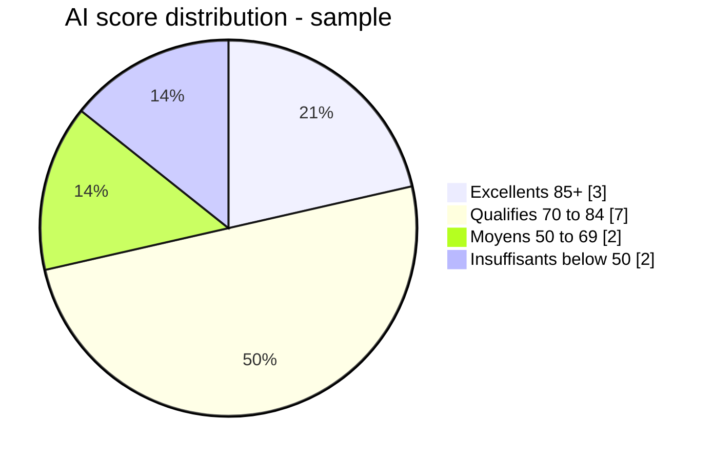

# Reporting & exports

## Purpose

The reporting module gives HR leadership operational intelligence across campaigns: KPIs, a conversion funnel, AI score distribution, a ranked candidate leaderboard, and downloadable Excel/PDF reports.

## Screenshot

## Filters

| Filter | Values |
|--------|--------|
| `offerId` | A specific offer, or omitted/null for all offers |
| `period` | `LAST_30_DAYS` (`30d`), `LAST_90_DAYS` (`90d`), `THIS_YEAR` (`1y`), `ALL` |

## KPIs

| KPI | Metric |
|-----|--------|
| Campaign Volume | `totalApplications`; `screenedApplications` and screening rate |
| Talent Quality | `averageScore`, `maxScore` |
| Offer Selectivity | `qualifiedCount` (where `passed_min_score = true`), qualification rate |
| Recruitment Outcome | `hiredCount`, conversion rate, `rejectedCount` |

All rate formulas guard against division by zero and return `0.0%` for empty scopes.

## Conversion funnel

Five sequential stages: **Reçues → Admissibles IA → Présélectionnés → Entretiens → Recrutés**.

- **Reçues** — all applications (100%).
- **Admissibles IA** — `passed_min_score = true`.
- **Présélectionnés** — status in `SHORTLISTED`/`INTERVIEWING`/`HIRED`, or a history row to `SHORTLISTED`.
- **Entretiens** — status in `INTERVIEWING`/`HIRED`, or a history row to `INTERVIEWING`.
- **Recrutés** — status `HIRED`.

Historical transitions ensure counts are monotonically non-increasing across stages.

## Score distribution

Scores (0–100) are bucketed into four tiers:

| Tier | Range |
|------|-------|
| Excellents | ≥ 85 |
| Qualifiés | 70 – 84.9 |
| Moyens | 50 – 69.9 |
| Insuffisants | < 50 |

Rendered as a Chart.js doughnut chart. A typical distribution looks like:

## Leaderboard

Top candidates sorted by `total_score DESC NULLS LAST`, then `applied_at ASC`. Columns include rank, identity, offer title, score, admissibility badge, status, submission date, and category subscores. Rows deep-link to `/hr/candidates/:applicationId`.

## Exports

### Excel (`ExcelExportService`, Apache POI)
Streams an in-memory `.xlsx` with 13 columns (rank, name, email, phone, offer, date, status, global score, admissible, and four category subscores). Scores are numeric cells so analysts can use native Excel formulas.

### PDF (`PdfExportService`, OpenPDF)
A4 executive summary: header, KPI grid, funnel table, score-tier summary, top-10 table, and a confidentiality footer with page numbering.

Filenames are ASCII-normalized and slugified:
- `reporting-candidats-[slug].xlsx`
- `rapport-synthese-[slug].pdf`

## Performance

- **Single-pass SQL** — `COUNT(*) FILTER (WHERE ...)` / `AVG(...) FILTER (...)` compute all metrics in PostgreSQL, avoiding entity hydration and N+1.
- **One consolidated payload** — `GET /reporting/stats` returns KPIs, funnel, distribution, and top candidates together.
- **Runtime type handling** — native `TIMESTAMPTZ` values arrive as `java.time.Instant` and are converted to UTC `OffsetDateTime`.

## Reference

Reporting endpoints, with roles and common query params (`offerId`, `period`, `limit`, `timezone`/`X-Timezone`), are listed in the [API Reference](../06-api/reference.md#reporting).

## Demo data

A seeded dataset (`V7__demo_seed.sql`) covers all score tiers and time windows for demonstrating the module. See [Demo Seed Data](../08-appendices/seed-data.md).

## Related

- [API Reference](../06-api/reference.md)
- [Dashboard](dashboard.md)
- [Seed Data](../08-appendices/seed-data.md)
