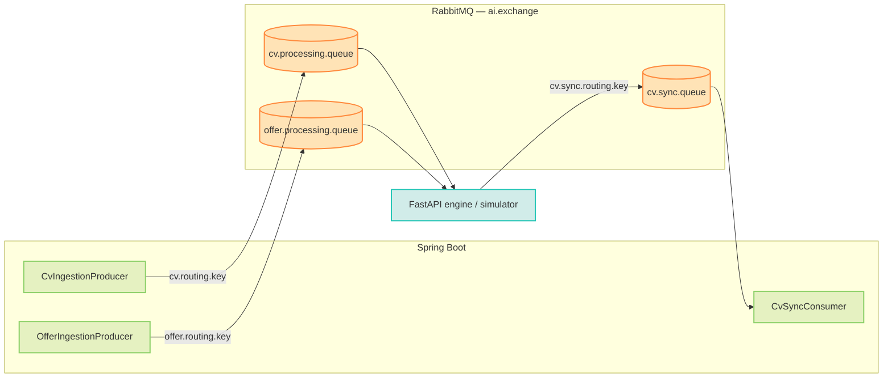

# Messaging

## Purpose

RabbitMQ decouples the backend from the FastAPI engine. Tasks are published to request queues and results returned on a response queue, all on a single direct exchange.

## Topology

| Queue | Exchange | Routing key | Direction | Producer | Consumer |
|-------|----------|-------------|-----------|----------|----------|
| `cv.processing.queue` | `ai.exchange` | `cv.routing.key` | Request | `CvIngestionProducer` | FastAPI engine / `SimulationNlpService` |
| `offer.processing.queue` | `ai.exchange` | `offer.routing.key` | Request | `OfferIngestionProducer` | FastAPI engine / `SimulationOfferService` |
| `cv.sync.queue` | `ai.exchange` | `cv.sync.routing.key` | Result | FastAPI engine / `SimulationNlpService` | `CvSyncConsumer` (`@RabbitListener`) |

All queues are durable. Messages use the Jackson JSON converter.

## Listener retry

Configured under `spring.rabbitmq.listener.simple`:

- `default-requeue-rejected: false` — a failed message is not requeued indefinitely.
- Retry: enabled, 3 attempts, 2 s initial interval, ×2 multiplier, 10 s cap.

## Simulation mode

When `AI_SIMULATION_ENABLED=true`, both simulators are registered as AMQP listeners inside the backend JVM. Both follow a deterministic **2-success / 1-fail** cycle:

- `SimulationNlpService` consumes `cv.processing.queue`, waits 6–9 s, and publishes a result to `cv.sync.queue`.
- `SimulationOfferService` consumes `offer.processing.queue`, waits 2–3 s, and posts the result to the offer sync endpoint.

This exercises the real broker without the external FastAPI engine. Set the flag to `false` to disable both.

## Why a queue instead of direct HTTP

Durability, decoupling, and backpressure — rationale in [Design Decisions](../08-appendices/decisions.md#messaging--ai-flow).

## Related

- [AI Contract](ai-contract.md)
- [Configuration](../07-operations/configuration.md)
- [CV Ingestion](../04-features/cv-ingestion.md)
