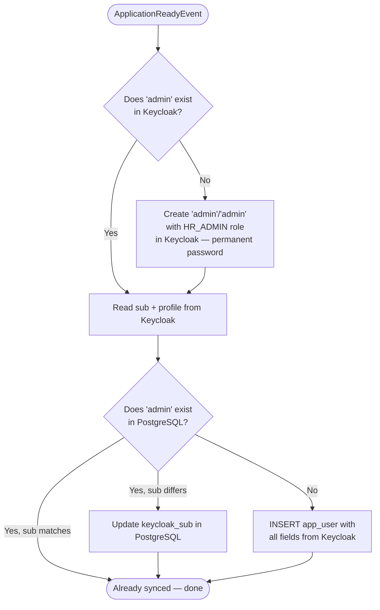
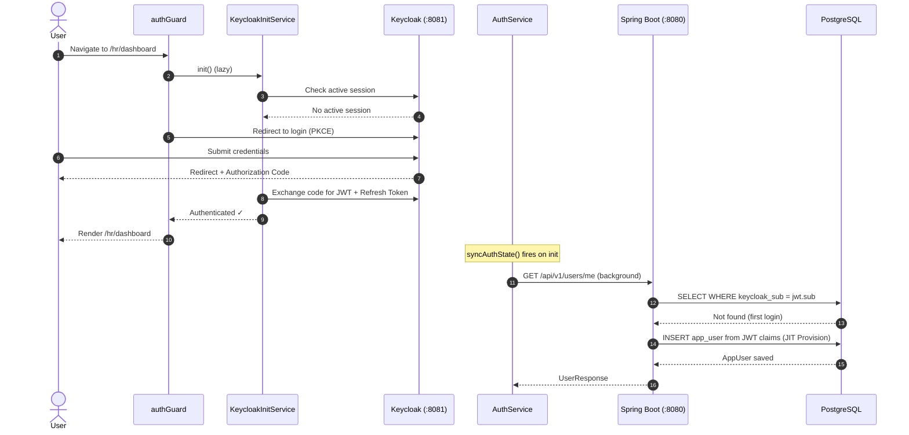
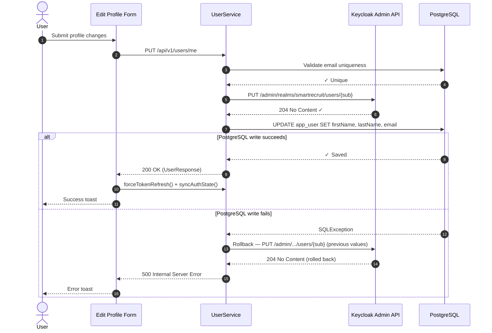

# SmartRecruit — Authentication & User Management Architecture

**Runtime Stack:** Angular 18+ (Zoneless Signals) · Spring Boot 4.1+ (Java 21 LTS) · Keycloak 24.0 · PostgreSQL 16+  
**Classification:** Internal Technical Architecture & Developer Reference

---

## Table of Contents

1. [Architectural Overview](#1-architectural-overview)
2. [System Boundaries & Component Directory](#2-system-boundaries--component-directory)
3. [Configuration Reference](#3-configuration-reference)
4. [Startup & Admin Seeder](#4-startup--admin-seeder)
5. [Frontend Security Architecture (Angular)](#5-frontend-security-architecture-angular)
6. [Backend Security Architecture (Spring Boot)](#6-backend-security-architecture-spring-boot)
7. [Keycloak ↔ PostgreSQL Synchronization Model](#7-keycloak--postgresql-synchronization-model)
8. [User Management Lifecycle (CRUD)](#8-user-management-lifecycle-crud)
9. [End-to-End Sequence Diagrams](#9-end-to-end-sequence-diagrams)
10. [Role-Based Access Control (RBAC) Matrix](#10-role-based-access-control-rbac-matrix)
11. [Developer Implementation Guidelines](#11-developer-implementation-guidelines)

---

## 1. Architectural Overview

SmartRecruit uses a **hybrid identity and persistence architecture**: Keycloak owns all credentials, sessions, and token issuance. PostgreSQL owns relational user metadata needed for domain foreign keys (who created an offer, who changed a workflow status, etc.).

```
┌─────────────────────────────────────────────────────────────────────────────┐
│ 1. CLIENT LAYER (Angular 18+ SPA — :4200)                                   │
│    • Public Routes  (/careers/**)  ──▶ Zero Keycloak overhead               │
│    • Protected Routes (/hr/**)     ──▶ Lazy-initialized authGuard           │
│    • All HTTP calls                ──▶ keycloakBearerInterceptor            │
└─────────────────────────────────────────────────────────────────────────────┘
          │ OIDC Authorization Code + PKCE     │ HTTPS / Bearer JWT
          ▼                                    ▼
┌─────────────────────┐         ┌──────────────────────────────────────────────┐
│ 2. IDENTITY LAYER   │         │ 3. RESOURCE SERVER LAYER (Spring Boot :8080) │
│  Keycloak (:8081)   │         │   • SecurityFilterChain (Stateless JWT)      │
│  Realm: smartrecruit│◀────────│   • JwtAuthConverter  (role extraction)      │
│  Clients:           │ Admin   │   • KeycloakAdminService (Admin REST API)    │
│   • smartrecruit-   │   API   │   • UserService (CRUD + JIT Provisioning)    │
│     frontend        │ (Client │   • SecurityUtils  (request identity)        │
│   • smartrecruit-   │  Creds) │   • AdminSeeder  (startup bootstrap)         │
│     backend         │         │                                              │
│  RSA-256 Signing    │         │                                              │
└─────────────────────┘         └──────────────────────────────────────────────┘
                                                   │ JDBC
                                                   ▼
                                 ┌──────────────────────────────────────────────┐
                                 │ 4. PERSISTENCE LAYER (PostgreSQL :5432)      │
                                 │    Table: app_user  (keycloak_sub indexed)   │
                                 │    FK targets: offer, workflow_status_history│
                                 └──────────────────────────────────────────────┘
```

### Core Design Principles

| # | Principle | Rationale |
|---|-----------|-----------|
| 1 | **Zero Password Footprint** | Passwords, MFA, and sessions are handled exclusively by Keycloak. No credentials ever touch the backend database. |
| 2 | **Stateless JWT Verification** | Spring Boot acts as an OAuth2 Resource Server, verifying JWT signatures against Keycloak's public JWKS endpoint. No session state is maintained server-side. |
| 3 | **Local Relational Identity** | The `app_user` table maps to Keycloak via `keycloak_sub` (UUID) to preserve relational foreign keys throughout the domain model. |
| 4 | **JIT Provisioning** | Users logging in for the first time are automatically provisioned in PostgreSQL from their JWT claims — no manual database seeding required. |
| 5 | **Self-Healing Sync** | On every `GET /api/v1/users/me` call, PostgreSQL is silently updated if any JWT claim (email, firstName, lastName) differs from the local record. |
| 6 | **Non-Blocking Public Traffic** | Public career pages bypass Keycloak completely to prevent iframe freezes and deliver instant page loads. |

---

## 2. System Boundaries & Component Directory

| Layer | Host | Key Files | Responsibility |
|:------|:-----|:----------|:---------------|
| **Client** | Browser (`:4200`) | [`auth.guard.ts`](../frontend/src/app/core/guards/auth.guard.ts)<br>[`keycloak-bearer.interceptor.ts`](../frontend/src/app/core/auth/keycloak-bearer.interceptor.ts)<br>[`keycloak-init.service.ts`](../frontend/src/app/core/auth/keycloak-init.service.ts)<br>[`auth.service.ts`](../frontend/src/app/core/auth/auth.service.ts) | Lazy Keycloak bootstrap, token attachment & auto-refresh, reactive auth state signals |
| **Identity** | Docker (`:8081`) | Realm: `smartrecruit`<br>Client: `smartrecruit-frontend` (public SPA)<br>Admin client: `smartrecruit-backend` (service account in `smartrecruit`) | Credentials, RSA-256 token signing, SSO sessions, Admin REST API |
| **Backend** | Spring Boot (`:8080`) | [`SecurityConfig.java`](../backend/src/main/java/com/smartrecruit/backend/config/SecurityConfig.java)<br>[`JwtAuthConverter.java`](../backend/src/main/java/com/smartrecruit/backend/security/JwtAuthConverter.java)<br>[`SecurityUtils.java`](../backend/src/main/java/com/smartrecruit/backend/security/SecurityUtils.java)<br>[`KeycloakAdminService.java`](../backend/src/main/java/com/smartrecruit/backend/integration/keycloak/KeycloakAdminService.java)<br>[`UserService.java`](../backend/src/main/java/com/smartrecruit/backend/modules/auth/services/UserService.java)<br>[`AdminSeeder.java`](../backend/src/main/java/com/smartrecruit/backend/modules/auth/services/AdminSeeder.java) | Stateless JWT verification, role extraction, dual-write sync, JIT provisioning, admin bootstrap |
| **Persistence** | PostgreSQL (`:5432`) | Entity: [`AppUser.java`](../backend/src/main/java/com/smartrecruit/backend/modules/auth/entities/AppUser.java) | Local user metadata, FK target for domain entities |

---

## 3. Configuration Reference

All Keycloak settings are declared in [`application.yml`](../backend/src/main/resources/application.yml). Environment variables override defaults for Docker/production:

```yaml
keycloak:
  realm: smartrecruit
  url: ${KEYCLOAK_URL:http://localhost:8081}/realms/${keycloak.realm}
  admin:
    server-url: ${KEYCLOAK_SERVER_URL:http://localhost:8081}
    client-id: ${KEYCLOAK_BACKEND_CLIENT_ID:smartrecruit-backend}
    client-secret: ${KEYCLOAK_BACKEND_SECRET:smartrecruit-backend-secret}
```

> [!IMPORTANT]
> **Strict Realm Isolation**: Spring Boot operates strictly within the `smartrecruit` realm using the `smartrecruit-backend` service account client (Client Credentials grant). No human credentials or `master` realm access are used.

---

## 4. Startup & Admin Seeder

[`AdminSeeder.java`](../backend/src/main/java/com/smartrecruit/backend/modules/auth/services/AdminSeeder.java) runs on `ApplicationReadyEvent` and performs a **two-way, self-healing synchronization** for the default `admin` account:



> [!NOTE]
> The `admin` user is pre-configured in `realm-export.json` with the `HR_ADMIN` realm role and `account` client roles (`view-profile`, `manage-account`). In addition, `AdminSeeder.java` dynamically checks and enforces these role mappings on every startup, ensuring complete self-healing across both fresh and existing Keycloak deployments.

---

## 5. Frontend Security Architecture (Angular)

### 5.1 Deferred Lazy Initialization

Keycloak is **not** initialized in `APP_INITIALIZER`. Global initialization causes silent `check-sso` `<iframe>` requests that freeze public pages on modern browsers.

Instead, [`KeycloakInitService`](../frontend/src/app/core/auth/keycloak-init.service.ts) is invoked **lazily** only when `authGuard` first intercepts a protected route navigation. This ensures:
- Public pages (`/careers/**`) load with **zero Keycloak overhead**
- Protected pages (`/hr/**`) trigger login on first access

### 5.2 AuthService — Reactive Signal State

[`AuthService`](../frontend/src/app/core/auth/auth.service.ts) is the central reactive auth façade, built entirely on Angular signals:

```typescript
// Reactive state — no Zone.js, no subscriptions needed in templates
readonly isAuthenticated = signal<boolean>(false);
readonly roles = signal<string[]>([]);
readonly currentUser = signal<UserProfile | null>(null);

// Derived computed signals — update automatically when roles changes
readonly isAdmin    = computed(() => this.hasRole(UserRole.HR_ADMIN));
readonly isRecruiter = computed(() => this.hasRole(UserRole.RECRUITER));
readonly isViewer   = computed(() => this.hasRole(UserRole.VIEWER));
```

**On authentication (`syncAuthState`):**
1. Sets `isAuthenticated`, `roles`, and `currentUser` signals from the live Keycloak token.
2. Fires a **background** `GET /api/v1/users/me` call to trigger self-healing sync of the PostgreSQL user record against the verified JWT claims.

### 5.3 HTTP Bearer Interceptor

[`keycloakBearerInterceptor`](../frontend/src/app/core/auth/keycloak-bearer.interceptor.ts) is registered in [`app.config.ts`](../frontend/src/app/app.config.ts) and handles all outgoing HTTP requests:

| Request Pattern | Behavior |
|:----------------|:---------|
| `/api/v1/public/**` | Pass-through — no token injected |
| All other `/api/**` | Refresh token if expiring within 30 s (`updateToken(30)`), then attach `Authorization: Bearer <JWT>` |

---

## 6. Backend Security Architecture (Spring Boot)

### 6.1 Stateless Security Filter Chain

[`SecurityConfig.java`](../backend/src/main/java/com/smartrecruit/backend/config/SecurityConfig.java) configures Spring Security as an OAuth2 Resource Server:

- **Session Policy:** `STATELESS` — no server-side session is ever created.
- **JWT Verification:** Tokens are validated via Keycloak's public JWKS.
- **Permit All:** `/v3/api-docs/**`, `/swagger-ui/**`, `/api/v1/public/**`, `/api/v1/internal/**`
- **Authenticated:** Everything else requires a valid Bearer JWT.

### 6.2 SecurityUtils — Request Identity Resolution

[`SecurityUtils`](../backend/src/main/java/com/smartrecruit/backend/security/SecurityUtils.java) provides helpers for resolving the authenticated user within any Spring component:

```java
// Get the raw Keycloak UUID (sub claim)
Optional<String> sub = securityUtils.getCurrentUserSub();

// Get the full AppUser entity (with JIT provisioning fallback)
Optional<AppUser> user = securityUtils.getCurrentUser();
// ↑ If user is not in PostgreSQL yet, automatically calls provisionOrLinkUser(jwt)
```

### 6.3 KeycloakAdminService — Admin REST Client

[`KeycloakAdminService`](../backend/src/main/java/com/smartrecruit/backend/integration/keycloak/KeycloakAdminService.java) wraps the Keycloak Admin REST API using the official `keycloak-admin-client`.

> [!NOTE]
> `KeycloakAdminService` authenticates directly against the **`smartrecruit` realm** using the `smartrecruit-backend` service account client with `manage-users` and `view-users` roles. It never touches or accesses the `master` realm. All profile updates use a **fetch-before-update** pattern to preserve existing user representation attributes.

---

## 7. Keycloak ↔ PostgreSQL Synchronization Model

### 7.1 `app_user` Table Schema

The `keycloak_sub` column is the **primary join key** between Keycloak and PostgreSQL.

### 7.2 JIT Provisioning (Just-In-Time)

When a user authenticates via Keycloak for the first time, they receive a JWT. On the first protected API call, [`UserService.provisionOrLinkUser(jwt)`](../backend/src/main/java/com/smartrecruit/backend/modules/auth/services/UserService.java) is triggered:

```
JWT arrives → No matching keycloak_sub in app_user?
  Step 1: Search by username
  Step 2: Search by email
  Step 3 (found match): Link — update keycloak_sub + sync profile fields
  Step 3 (no match):    JIT INSERT — create new app_user from JWT claims
                        role extracted from realm_access.roles
```

### 7.3 Self-Healing Token Sync

On every `GET /api/v1/users/me`, [`UserService.getMyProfile()`](../backend/src/main/java/com/smartrecruit/backend/modules/auth/services/UserService.java) compares the live JWT claims against the PostgreSQL record, silently updating PostgreSQL if there is any drift.

### 7.4 Profile Update — Dual-Write with Compensating Rollback

`PUT /api/v1/users/me` writes to both stores in sequence. If PostgreSQL fails after Keycloak succeeds, a **compensating rollback** reverts Keycloak to the previous state.

---

## 8. User Management Lifecycle (CRUD)

All admin user management operations go through `POST/PUT/DELETE /api/v1/users/**` and require `HR_ADMIN` role.

### 8.1 Create User
1. Validate `username` (pattern format without spaces) and `email` are unique in PostgreSQL.
2. Generate a secure 12-character random password.
3. Create user in Keycloak with **temporary** password (`temporary: true`).
4. Assign the requested realm role (`HR_ADMIN`, `RECRUITER`, `VIEWER`) and `account` client roles (`view-profile`, `manage-account`).
5. Insert `app_user` record in PostgreSQL. If database save or role assignment fails, a **compensating deletion** in Keycloak is triggered to maintain atomicity.
6. Send welcome email with temporary credentials.

### 8.2 Delete User
- A user **cannot delete their own account** (throws `400 Bad Request`).
- Keycloak deletion is **idempotent**: if the user's `keycloak_sub` no longer exists in Keycloak (e.g. a legacy seed record), the 404 is ignored and PostgreSQL deletion proceeds cleanly.

---

## 9. End-to-End Sequence Diagrams

### 9.1 First Login & JIT Provisioning



---

### 9.2 Profile Update with Dual-Write & Compensating Rollback



---

## 10. Role-Based Access Control (RBAC) Matrix

| Endpoint Pattern | Method | Permitted Roles | Description |
|:-----------------|:-------|:----------------|:------------|
| `/api/v1/public/**` | `GET`, `POST` | Anonymous | Public jobs and applications |
| `/api/v1/internal/**` | All | Internal Network | Async AI callbacks |
| `/api/v1/users/me` | `GET`, `PUT` | All authenticated | Own profile management |
| `/api/v1/users/**` | All | `HR_ADMIN` | User CRUD |
| `/api/v1/offers/**` | `POST`, `PUT`, `DELETE` | `HR_ADMIN`, `RECRUITER` | Offer management |

---

## 11. Developer Implementation Guidelines

### 11.1 Accessing the Current User (Backend)

Use [`SecurityUtils`](../backend/src/main/java/com/smartrecruit/backend/security/SecurityUtils.java):

```java
@Autowired SecurityUtils securityUtils;

AppUser user = securityUtils.getCurrentUser()
    .orElseThrow(() -> new UserNotFoundException("Not authenticated"));
```

### 11.2 Accessing Auth State in Angular Components

```typescript
@Component({ ... })
export class HeaderComponent {
  private auth = inject(AuthService);

  readonly isAuthenticated = this.auth.isAuthenticated;  // signal<boolean>
  readonly isAdmin = this.auth.isAdmin;                  // computed<boolean>
  readonly currentUser = this.auth.currentUser;          // signal<UserProfile|null>
}
```
