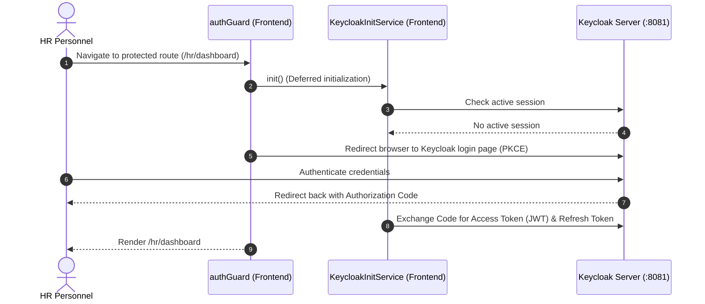
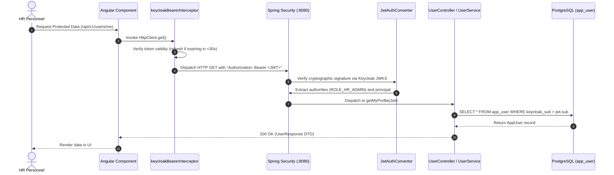
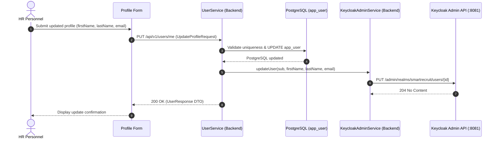

# SmartRecruit Authentication & Identity Architecture Specification

**Target Runtime:** Angular 18+ (Zoneless Signals), Spring Boot 4.1+ (Java 21 LTS), Keycloak 24.0, PostgreSQL 15+  
**Classification:** Internal Technical Architecture & Developer Standard  

---

## Table of Contents

1. [Architectural Overview & Design Principles](#1-architectural-overview--design-principles)
2. [System Boundaries & Component Directory](#2-system-boundaries--component-directory)
3. [Frontend Security Architecture (Angular)](#3-frontend-security-architecture-angular)
4. [Backend Security Architecture (Spring Boot Resource Server)](#4-backend-security-architecture-spring-boot-resource-server)
5. [Keycloak & PostgreSQL Synchronization Model](#5-keycloak--postgresql-synchronization-model)
6. [End-to-End Sequence Workflows](#6-end-to-end-sequence-workflows)
7. [Role-Based Access Control (RBAC) Matrix](#7-role-based-access-control-rbac-matrix)
8. [Developer Implementation Guidelines](#8-developer-implementation-guidelines)

---

## 1. Architectural Overview & Design Principles

SmartRecruit uses a **hybrid identity and persistence architecture**: Keycloak manages identities, credentials, and tokens, while PostgreSQL maintains local user records for relational integrity (e.g., job offer creators and workflow audit logs).

```
┌─────────────────────────────────────────────────────────────────────────────┐
│ 1. CLIENT LAYER (Angular 18+ Single Page Application)                       │
│    • Public Routes (/careers)    ──> Zero authentication overhead           │
│    • Protected Routes (/hr/**)   ──> Guarded via authGuard (Lazy Init)      │
│    • HTTP Pipeline               ──> keycloakBearerInterceptor              │
└─────────────────────────────────────────────────────────────────────────────┘
          │ (OIDC / PKCE Redirect)         │ (HTTPS / Bearer JWT Token)
          ▼                                ▼
┌───────────────────────────┐    ┌────────────────────────────────────────────┐
│ 2. IDENTITY LAYER         │    │ 3. RESOURCE SERVER LAYER (Spring Boot)     │
│    Keycloak Server (:8081)│    │    • SecurityFilterChain (Stateless)       │
│    • Realm: smartrecruit  │    │    • JwtAuthConverter (Authority Mapping)  │
│    • RSA Token Signing    │◄───┼─── • KeycloakAdminService (Admin REST API) │
│    • User Directory (SSO) │(Admin API • UserService (Profile CRUD)          │
└───────────────────────────┘    └────────────────────────────────────────────┘
                                                   │
                                                   ▼ (SQL Queries)
                                 ┌────────────────────────────────────────────┐
                                 │ 4. PERSISTENCE LAYER (PostgreSQL :5432)    │
                                 │    • app_user table (keycloak_sub index)   │
                                 │    • Relational FKs (offer, audit history) │
                                 └────────────────────────────────────────────┘
```

### Core Design Principles

1. **Zero Password Footprint**: Passwords, MFA, and SSO sessions are handled exclusively by Keycloak. No credentials touch the backend database.
2. **Stateless Verification**: Spring Boot acts as an OAuth2 Resource Server, verifying JWT signatures using Keycloak's public JWKS.
3. **Local Relational Identity**: The local PostgreSQL `app_user` table maps to Keycloak via `keycloak_sub` (UUID) to preserve database foreign keys (`offer.created_by`, `workflow_status_history.changed_by`).
4. **Non-Blocking Public Traffic**: Public career pages bypass Keycloak completely, preventing iframe freezes and ensuring instant page loads.

---

## 2. System Boundaries & Component Directory

| Layer | Runtime Host | Key Files | Responsibility | Protocol |
| :--- | :--- | :--- | :--- | :--- |
| **Client** | Browser (`:4200`) | [`auth.guard.ts`](../frontend/src/app/core/guards/auth.guard.ts)<br>[`keycloak-bearer.interceptor.ts`](../frontend/src/app/core/auth/keycloak-bearer.interceptor.ts)<br>[`keycloak-init.service.ts`](../frontend/src/app/core/auth/keycloak-init.service.ts)<br>[`auth.service.ts`](../frontend/src/app/core/auth/auth.service.ts) | • Lazy Keycloak bootstrap<br>• Token attachment & auto-refresh ($<30\text{s}$ buffer)<br>• Reactive auth state signals | HTTPS / OIDC<br>REST / JSON |
| **Identity** | Docker (`:8081`) | Realm: `smartrecruit`<br>Client: `smartrecruit-frontend` | • Credentials, session state & RS256 token issuance<br>• Admin REST API for profile synchronization | OpenID Connect<br>Admin REST API |
| **Backend** | Spring Boot (`:8080`) | [`SecurityConfig.java`](../backend/src/main/java/com/smartrecruit/backend/config/SecurityConfig.java)<br>[`JwtAuthConverter.java`](../backend/src/main/java/com/smartrecruit/backend/security/JwtAuthConverter.java)<br>[`UserService.java`](../backend/src/main/java/com/smartrecruit/backend/modules/auth/services/UserService.java)<br>[`KeycloakAdminService.java`](../backend/src/main/java/com/smartrecruit/backend/integration/keycloak/KeycloakAdminService.java) | • Stateless JWT verification against JWKS<br>• Extract `realm_access.roles` $\rightarrow$ `ROLE_*`<br>• Dual-write synchronization to Keycloak | REST / JSON<br>Keycloak Admin Client |
| **Persistence** | PostgreSQL (`:5432`) | Table: `app_user`<br>Migration: [`V1__init.sql`](../backend/src/main/resources/db/migration/V1__init.sql) | • Local user profile metadata<br>• Foreign key target for application domain entities | JDBC / PostgreSQL Driver |

---

## 3. Frontend Security Architecture (Angular)

### 3.1 Deferred Lazy Initialization
Global initialization during `APP_INITIALIZER` causes silent `check-sso` `<iframe>` checks that freeze public pages on modern browsers. SmartRecruit initializes Keycloak **lazily** only when navigating to routes guarded by [`authGuard`](../frontend/src/app/core/guards/auth.guard.ts) via [`KeycloakInitService`](../frontend/src/app/core/auth/keycloak-init.service.ts).

### 3.2 HTTP Bearer Interceptor
All outgoing HTTP requests pass through [`keycloakBearerInterceptor`](../frontend/src/app/core/auth/keycloak-bearer.interceptor.ts) registered in [`app.config.ts`](../frontend/src/app/app.config.ts):
* **Public APIs (`/api/v1/public/**`)**: Immediate pass-through without touching Keycloak.
* **Protected APIs**: Refreshes token if expiring within 30 seconds (`keycloak.updateToken(30)`), attaches `Authorization: Bearer <token>`, and forwards the request.

---

## 4. Backend Security Architecture (Spring Boot Resource Server)

### 4.1 Stateless Security Filter Chain
[`SecurityConfig.java`](../backend/src/main/java/com/smartrecruit/backend/config/SecurityConfig.java) configures stateless OAuth2 resource server validation:
* **Whitelisted Routes**: `/v3/api-docs/**`, `/swagger-ui/**`, `/api/v1/public/**`, and internal service routes (`/api/v1/internal/**`).
* **Protected Routes**: All other endpoints require a valid JWT Bearer token.
* **Error Handling**: 401 Unauthorized and 403 Forbidden exceptions are routed to [`AuthExceptionHandler.java`](../backend/src/main/java/com/smartrecruit/backend/exceptions/AuthExceptionHandler.java) for standardized JSON responses.

### 4.2 JWT Authority Extraction
[`JwtAuthConverter.java`](../backend/src/main/java/com/smartrecruit/backend/security/JwtAuthConverter.java) extracts roles from `jwt.claims["realm_access"]["roles"]` and maps them into Spring Security authorities (`ROLE_HR_ADMIN`, `ROLE_RECRUITER`, `ROLE_VIEWER`), enabling method-level security with `@PreAuthorize`.

---

## 5. Keycloak & PostgreSQL Synchronization Model

### 5.1 Relational User Schema (`app_user`)
Local PostgreSQL entity [`AppUser`](../backend/src/main/java/com/smartrecruit/backend/modules/auth/entities/AppUser.java) stores: `id` (UUID PK), `keycloakSub` (indexed unique UUID), `username`, `firstName`, `lastName`, `email`, `role`, and `createdAt`.

### 5.2 Startup Admin Bootstrapping
On application boot, [`AdminSeeder.java`](../backend/src/main/java/com/smartrecruit/backend/modules/auth/services/AdminSeeder.java) verifies if an `HR_ADMIN` exists in PostgreSQL. If missing, it queries the Keycloak Admin API for the `admin` account and replicates it into `app_user`.

### 5.3 Profile Update & Dual-Write Protocol
When updating a profile via `PUT /api/v1/users/me`:
1. [`UserService.java`](../backend/src/main/java/com/smartrecruit/backend/modules/auth/services/UserService.java) validates that the new email is not taken by another user.
2. Updates `app_user` in PostgreSQL.
3. Calls [`KeycloakAdminService.java`](../backend/src/main/java/com/smartrecruit/backend/integration/keycloak/KeycloakAdminService.java) to update Keycloak via Admin REST API.

---

## 6. End-to-End Sequence Workflows

### Workflow 1: Authentication & Route Access



---

### Workflow 2: Protected Resource Request



---

### Workflow 3: Profile Mutation & Keycloak Synchronization



---

## 7. Role-Based Access Control (RBAC) Matrix

| Endpoint Pattern | Method | Permitted Roles | Description |
| :--- | :--- | :--- | :--- |
| `/api/v1/public/offers/**` | `GET` | *Anonymous (Public)* | Public recruitment listings |
| `/api/v1/public/applications/**` | `POST` | *Anonymous (Public)* | Public candidate application submission |
| `/api/v1/internal/**` | *All* | *Internal Network* | Internal asynchronous AI/NLP callbacks |
| `/api/v1/users/me` | `GET`, `PUT` | `HR_ADMIN`, `RECRUITER`, `VIEWER` | Current user profile management |
| `/api/v1/offers/titles` | `GET` | `HR_ADMIN`, `RECRUITER`, `VIEWER` | Internal offer dropdown selectors |
| `/api/v1/offers/{id}` | `GET` | `HR_ADMIN`, `RECRUITER`, `VIEWER` | Internal deep-dive offer details |
| `/api/v1/offers/**` | `POST`, `PUT`, `DELETE` | `HR_ADMIN`, `RECRUITER` | Offer creation and modification |
| `/api/v1/applications/**` | `GET` | `HR_ADMIN`, `RECRUITER`, `VIEWER` | Candidate application review |
| `/api/v1/applications/**` | `PATCH`, `POST` | `HR_ADMIN`, `RECRUITER` | Workflow status transitions and imports |

---

## 8. Developer Implementation Guidelines

### 8.1 Implementing Public Endpoints
* Prefix controller paths with `/api/v1/public/`.
* Do not attach `@PreAuthorize`. The frontend interceptor automatically bypasses token injection.

### 8.2 Implementing Protected Endpoints
* Prefix paths with `/api/v1/` and enforce roles via `@PreAuthorize`:
  ```java
  @GetMapping("/offers")
  @PreAuthorize("hasAnyRole('HR_ADMIN', 'RECRUITER', 'VIEWER')")
  public ResponseEntity<List<OfferResponse>> getOffers() { ... }
  ```

### 8.3 Protecting Angular Routes
Attach `authGuard` and specify required roles in route definitions:
```typescript
{
  path: 'management',
  component: ManagementComponent,
  canActivate: [authGuard],
  data: { roles: ['HR_ADMIN'] }
}
```

### 8.4 Accessing User Identity in Angular
```typescript
export class UserMenuComponent {
  private authService = inject(AuthService);

  readonly isAuthenticated = this.authService.isAuthenticated;
  readonly isAdmin = this.authService.isAdmin;
  readonly userProfile = this.authService.getUserProfile();

  onLogout(): void {
    this.authService.logout().subscribe();
  }
}
```


