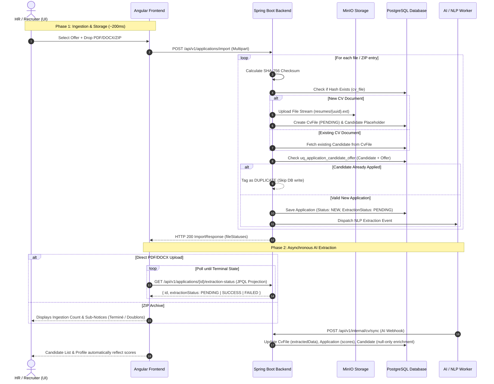

# Feature 3: Candidate Application & Bulk CV Ingestion with Asynchronous AI Matching

---

## 1. Feature Overview

The **Candidate Application & Ingestion Pipeline** is the core entry point for candidate profiles into SmartRecruit. It supports two main ingestion channels:
1. **Public Candidate Application (`/apply`)**: Direct candidate portal submission with verified form inputs (First name, Last name, Email, Phone, Offer ID, CV file).
2. **HR Bulk Import (`/import`)**: Recruiter batch upload of standalone CV files (PDF/DOCX) or multi-file ZIP archives against a target job offer.

Key System Capabilities:
- **Instant SHA-256 Deduplication**: Prevents duplicate document storage in MinIO and blocks duplicate applications per job offer.
- **2-Phase Asynchronous Processing**: Immediate synchronous ingestion (~200ms) with background AI NLP entity extraction and matching.
- **Resilient State Machine**: 6 distinct frontend task states (`PENDING`, `UPLOADING`, `PARSING`, `SUCCESS`, `DUPLICATE`, `FAILED`) with selective retries.
- **Data Synchronization**: In-place null-only candidate enrichment and lazy authenticated PDF preview streaming.

---

## 2. Ingestion Workflows & End-to-End Flow

### A. Public Direct Application (`POST /api/v1/applications/apply`)
1. Candidate fills out the public application form on the careers portal.
2. Form data (`ApplyRequest`) includes `firstName`, `lastName`, `email`, `phone`, `offerId`, and the CV file (`MultipartFile`).
3. Backend looks up candidate by email:
   - If candidate exists $\rightarrow$ updates name/phone and reuses existing `Candidate` record.
   - If candidate is new $\rightarrow$ creates a new `Candidate` entity.
4. File is processed: SHA-256 checksum calculated, uploaded to MinIO storage, linked to `CvFile` and `Application` in `PENDING` extraction state.
5. Dispatches NLP extraction event to background AI worker.

---

### B. HR Bulk Import & AI Processing (`POST /api/v1/applications/import`)



---

## 3. API Endpoints Reference

| Endpoint | Method | Role | Description |
|---|---|---|---|
| `/api/v1/applications/apply` | `POST` | `PUBLIC` | Direct public applicant form submission (Candidate + CvFile + Application). |
| `/api/v1/applications/import` | `POST` | `HR_ADMIN`, `RECRUITER` | Ingests a batch of PDF/DOCX CVs or ZIP archives against `offerId`. Returns minimal `ImportResponse`. |
| `/api/v1/applications/{id}/extraction-status` | `GET` | `HR_ADMIN`, `RECRUITER`, `VIEWER` | Ultra-fast lightweight JPQL projection query for UI polling during AI extraction. |
| `/api/v1/applications/{id}/cv` | `GET` | `HR_ADMIN`, `RECRUITER`, `VIEWER` | Authenticated lazy PDF streaming directly from MinIO with inline disposition. |
| `/api/v1/applications/{id}/re-extract` | `POST` | `HR_ADMIN`, `RECRUITER` | Resets application scores to null, sets extraction status to `PENDING`, and re-triggers AI. |
| `/api/v1/internal/cv/sync` | `POST` | `INTERNAL` | Asynchronous AI webhook endpoint that ingests extracted skills, scores, and candidate data. |

---

## 4. Data Transfer Objects (DTOs)

### A. `ApplyRequest` (Public Portal)
```java
public record ApplyRequest(
    @NotBlank String firstName,
    @NotBlank String lastName,
    @NotBlank @Email String email,
    String phone,
    @NotNull UUID offerId,
    @NotNull MultipartFile file
) {}
```

### B. `ImportResponse` & `FileImportStatus` (Bulk Ingestion)
```java
public record ImportResponse(List<FileImportStatus> fileStatuses) {
  public record FileImportStatus(
      String filename,
      UUID applicationId,       // Present if a new application was created
      Integer extractedCount,   // Number of CVs extracted if archive
      String errorCode,         // "DUPLICATE", "INVALID_FORMAT", "CORRUPTED", "EMPTY_ARCHIVE"
      String message,           // Human-readable summary message
      List<String> subErrors    // Detailed sub-errors for skipped/failed files inside ZIP
  ) {}
}
```

---

## 5. State Machine & Task Status Matrix

```
[ PENDING ] ──► [ UPLOADING (50%) ] ──► [ PARSING (75%) ] ──► [ SUCCESS (100%) ]
     │                                         │
     ├─────────────► [ DUPLICATE ]             ├─────────────► [ STALLED (0%) ] ──► [ Relancer ]
     │                                         │
     └─────────────► [ FAILED ]                └─────────────► [ FAILED (0%) ]
```

| State | Badge | Color | Retryable? | Behavior |
|---|---|---|---|---|
| **`PENDING`** | `En attente` | Gray / Slate | Yes | Queued in memory; waiting for recruiter to click "Démarrer l'importation". |
| **`UPLOADING`** | `Téléchargement` | Blue | No | Multipart HTTP transfer to backend (50% progress). |
| **`PARSING`** | `Extraction IA` | Amber Pulse | No | Backend created application; polling `/extraction-status` with backoff (75% progress). |
| **`STALLED`** | `Bloqué` | Orange | **Yes** | Backend marked job stalled (>5 min pending) or restore probe exceeded age. Inline "Relancer" resets & redispatches. |
| **`SUCCESS`** | `Terminé` | Emerald / Green | No | AI extraction completed or ZIP unpacked successfully. Direct link to profile. |
| **`DUPLICATE`** | `Doublon` | Amber Solid | **No** | Candidate already applied to this offer. Excluded from retry queue. |
| **`FAILED`** | `Échec` | Red | **Yes** | Corrupted ZIP, invalid format, or unrecoverable error. Can be retried via "Relancer". |

---

## 6. Key Architectural Decisions & Rationale

### 1. Granular Transaction Boundaries (No Monolithic `@Transactional`)
- **Decision**: Removed `@Transactional` from `CvIngestionService.importCandidates`.
- **Rationale**: An orchestrator batch loop must not be transactional. If File #2 is a duplicate, it throws `DuplicateResourceException` which is caught in the loop, allowing File #1, #3, and #4 to commit independently.

### 2. SHA-256 Storage Deduplication
- **Decision**: Every uploaded CV calculates a SHA-256 checksum before MinIO upload.
- **Rationale**: If Candidate X applies to multiple jobs with the same CV file, MinIO upload and raw text extraction are skipped, saving storage and cutting AI costs.

### 3. Null-Only Candidate Enrichment
- **Decision**: `NlpService` only updates `Candidate` entity fields (`firstName`, `lastName`, `email`, `phone`) if they are currently `null` or blank.
- **Rationale**: Prevents AI simulation drift from overwriting confirmed user data, avoids broken foreign keys, and guarantees 100% synchronization between Candidate List and Profile views.

### 4. Simple ZIP Container Classification
- **Decision**: An unpacked ZIP archive is classified as `SUCCESS` (`Terminé`) with message *"X CV(s) extrait(s), Y non traité(s)"* and sub-error notices, regardless of whether sub-files were duplicates.
- **Rationale**: The archive container itself was read successfully; duplicate files inside are reported as informational warnings rather than a red failure.

### 5. Reactive Non-Overlapping Polling with Exponential Backoff & Backend Stall Detection
- **Decision**: Replaced `setInterval`-based polling with an RxJS `expand` + `timer` + `switchMap` stream (`watchExtractionStatus$`) paired with a backend `@Scheduled` stall detector (`ExtractionStallDetector`).
- **Rationale**:
  - **Non-Overlapping Stream**: Guarantees exactly one in-flight HTTP request at a time, eliminating request pileup.
  - **Exponential Backoff**: Starts at 3 s, multiplies by 1.5×, capped at 15 s. Reduces server pressure while staying responsive early.
  - **Soft Stalled Warning**: At attempt 10 (~1.5 min), displays an informational *"L'analyse IA prend plus de temps..."* warning while continuing to poll.
  - **Backend Stall Sweeper**: Backend automatically sweeps every 1 minute (`PT1M`) and flags any `CvFile` pending for >5 min as `STALLED`, stopping pointless polling and showing an inline "Relancer" action.
  - **Stale Session Guard**: On page reload or session restore, if the task is older than 3 minutes (`maxRestorePollAgeMs: 180_000`), a single probe is fired instead of launching an aggressive polling loop.

---

## 7. Future Improvements & Planned Updates

1. **WebSocket / SSE Push**:
   Replace HTTP polling entirely with a server-sent event or WebSocket channel on `/api/v1/applications/{id}/status/stream` so the AI worker callback instantly pushes the terminal state to the browser with zero polling overhead.
2. **Granular ZIP Bulk Import Details**:
   Expand the bulk import results to display individual expandable sub-cards for each CV extracted from the ZIP archive with its own direct profile link and extraction status.


